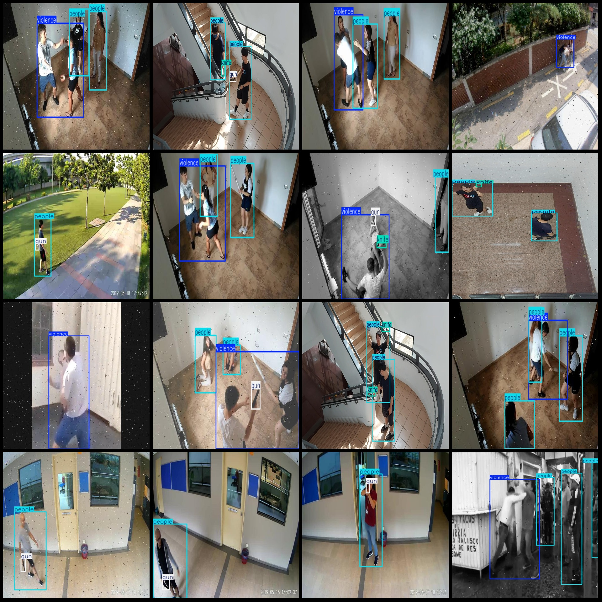
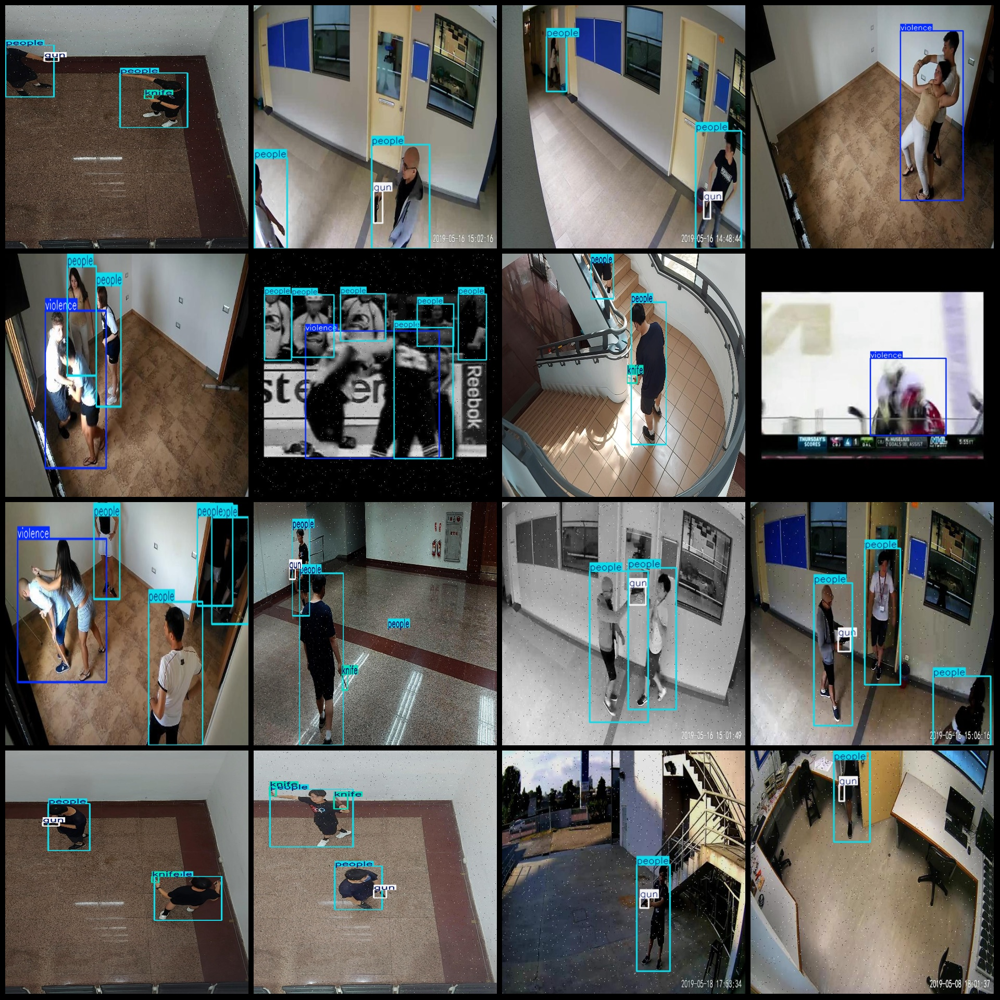

# Campus Violence Behavior Fighting with Knife Detection Dataset VOC+YOLO Format with 20991 Images in 4 Classes

Note: The dataset contains approximately one-third of the images as original, and the remaining are enhanced images. The enhancement methods include changing contrast, brightness, and adding noise.

The dataset format is Pascal VOC format + YOLO format (excluding the split path's txt file, only containing jpg images along with their corresponding VOC format xml files and yolo format txt files).

Number of images (jpg file count): 20991
Number of annotations (xml file count): 20991
Number of annotations (txt file count): 20991
Number of annotation categories: 4
Annotation category names (notice that the order of categories in the yolo format does not correspond to this, but refer to the classes.txt in the labels folder): ["gun", "knife", "people", "violence"]
Number of bounding boxes for each category:
- Gun bounding box count = 10807
- Knife bounding box count = 9440
- People bounding box count = 34665
- Violence bounding box count = 7781
Total bounding box count: 62693
Image resolution: Multi-resolution, such as 1920x1080, 1080x720, etc.
Using annotating tool: labelImg
Annotation rules: Drawing a rectangle around the class
Important note: There is no explicit statement on this dataset about any guarantee of model training accuracy or weight file precision.
Special declaration: This dataset does not make any guarantees regarding the accuracy of the trained models or weight files.

Image preview:
Annotation example:

Image

Here is a pay link on Stripe ( https://buy.stripe.com/3cs8yP7sY87d0vu9AB ). Please contact me lonlonago@foxmail.com after funding $89, and I will send you a complete data files , thank you!

